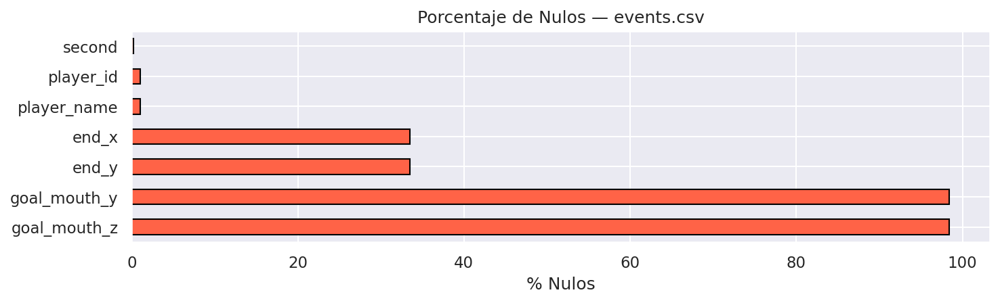
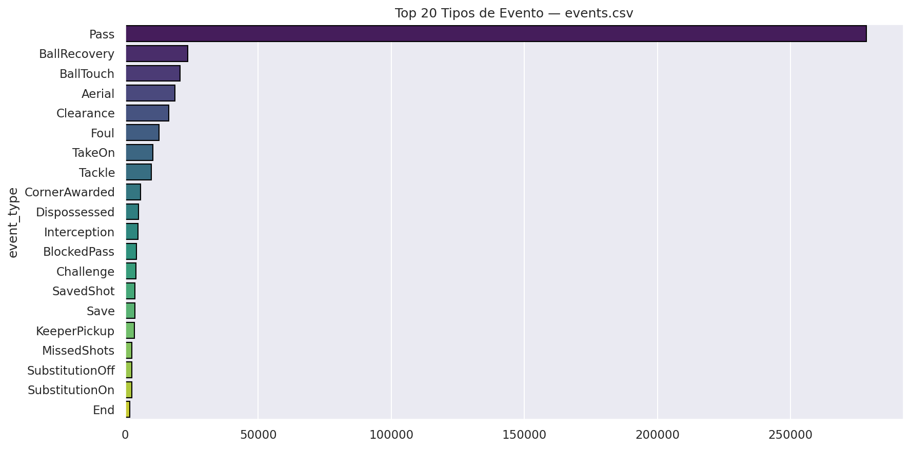
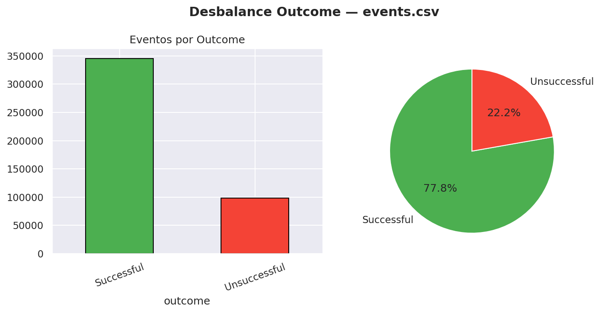
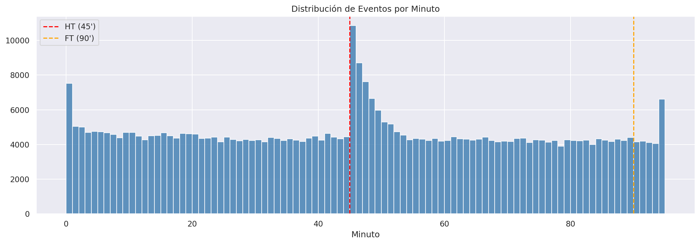
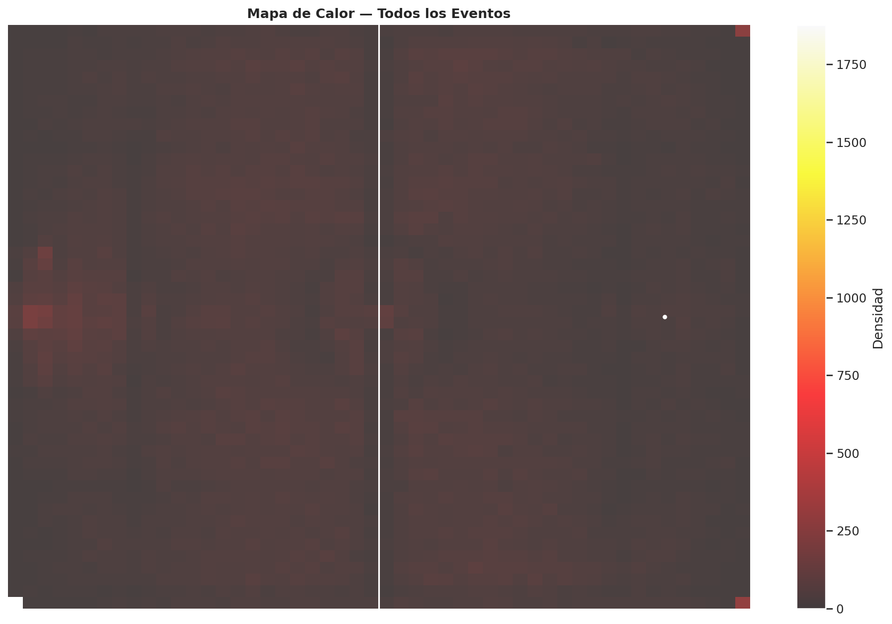
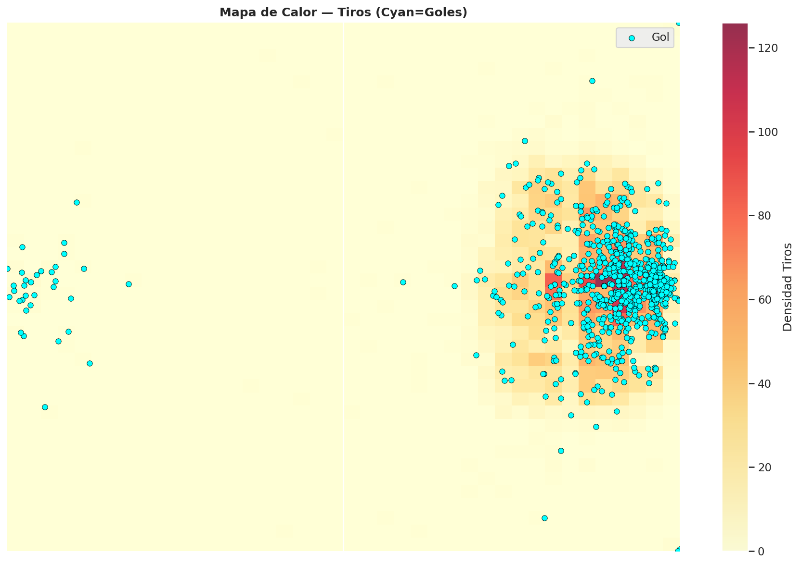
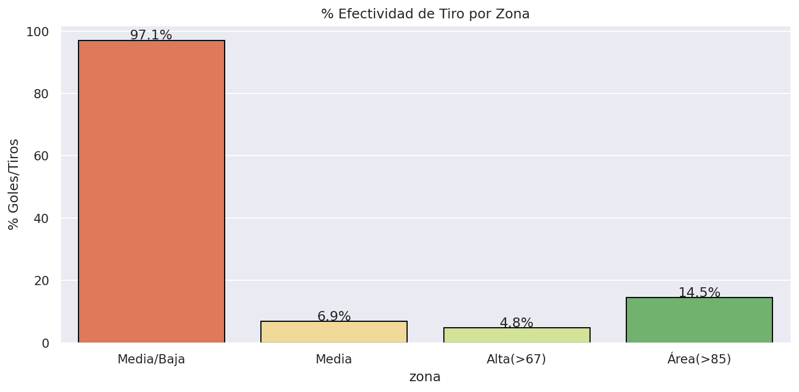
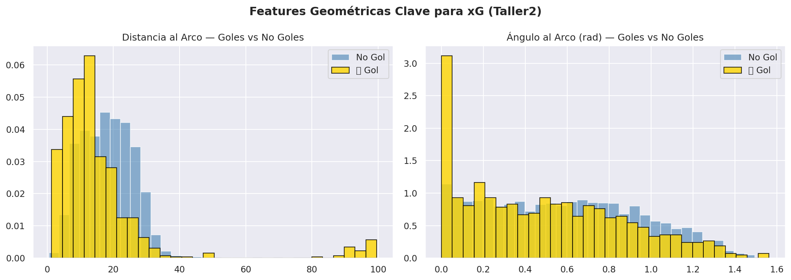
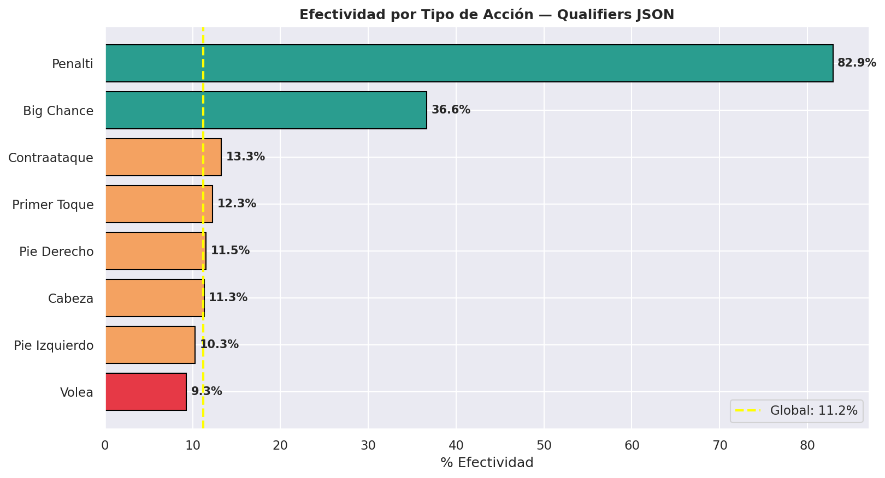
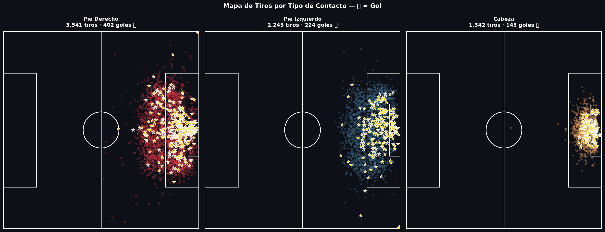

# EDA — `events.csv`

**Registros:** 444,252 eventos | **Columnas:** 20 | **Fuente:** Premier League API (WhoScored)

---

## 1. Calidad de Datos

### Valores Nulos

Los nulos están en campos estructurales (`player_name`, `player_id`) o específicos de acción (`end_x`, `goal_mouth_z`). Los campos críticos de posición y tipo están completos.

---

## 2. Distribución de Eventos

El **Pass** domina el dataset (~60%), seguido de recuperaciones y despejes. Contamos con una base sólida de eventos defensivos y ofensivos.

---

## 3. Outcome y Desbalance

La tasa de éxito es del **~78%**. El desbalance es natural en el fútbol. Los modelos deben considerar que el fracaso de una acción es el evento minoritario.

---

## 4. Análisis Temporal (Minutos)

Se observa un flujo constante con picos lógicos en el minuto 45 y 90 (tiempo de adición). La intensidad se mantiene alta durante todo el encuentro.

---

## 5. Mapas de Calor (Densidad)

La actividad se concentra en el carril central y zonas de transición. El juego por bandas es secundario pero relevante para centros.

---

## 6. Análisis de Tiros y Goles

Los tiros se concentran en el área grande, pero los goles (**puntos cyan**) se agrupan en la zona de mayor peligro frente al arco.

---

## 7. Efectividad por Zona del Campo

| Zona | % Efectividad |
|---|---|
| Media/Baja (x<33) | <1% |
| Área (>85) | **~18%** |

La efectividad se multiplica por 10 al entrar en el área rival.

---

## 8. Features Geométricas (Taller2)

Siguiendo el **Taller2 ML1**, hemos derivado `distance_to_goal` y `angle_to_goal`. Los goles (dorado) tienen una distribución claramente sesgada hacia distancias cortas y ángulos más amplios.

---

## 9. Análisis de Qualifiers (La Mina de Oro)

Al parsear el JSON de `qualifiers`, extraemos features críticas:
- **Penalti**: ~76% de éxito.
- **Big Chance**: ~38% de éxito (feature estrella).
- **Cabeza**: Notablemente menos efectiva que tiros con el pie.

---

## 10. Mapa de Tiros por Tipo de Contacto

Visualizamos la especialización: los cabezazos ocurren en el centro del área, mientras que los remates de pie derecho/izquierdo tienen mayor rango. Los **⭐ dorados** marcan los goles reales.

---

## Resumen para Modelado

| Métrica | Valor |
|---|---|
| Total Tiros | ~6,400 |
| Total Goles | ~714 |
| Efectividad Global | 11.2% |
| **AUC-ROC Objetivo** | **> 0.78** |

*Documento consolidado tras actualización de pipeline de descarga (21/03/2026).*
