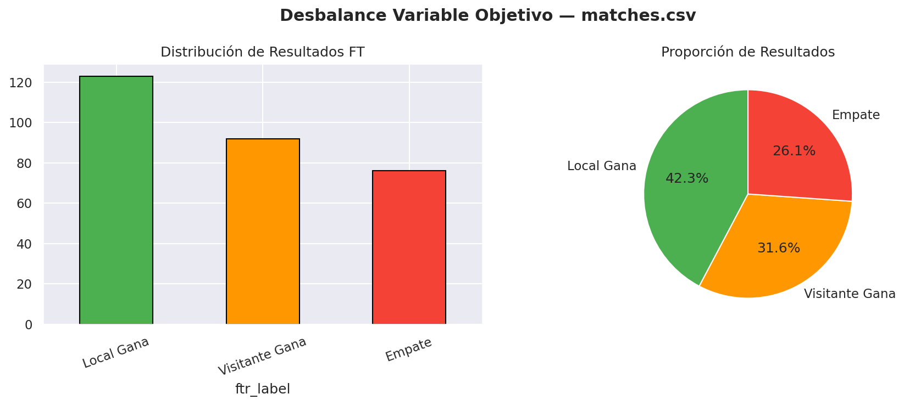
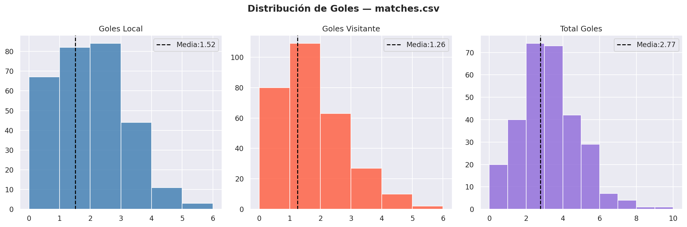
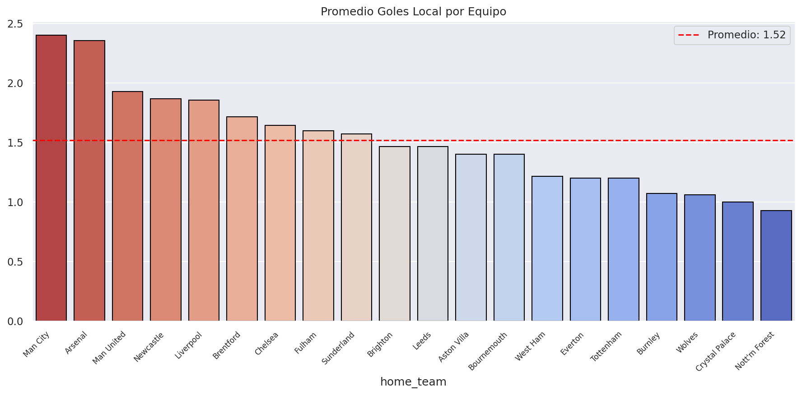
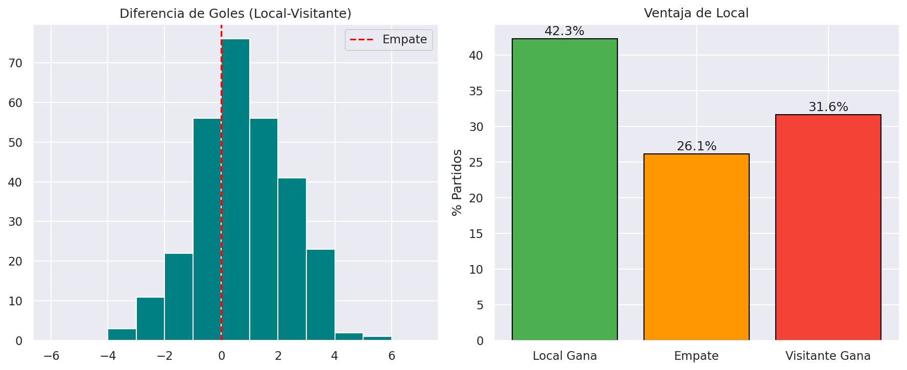
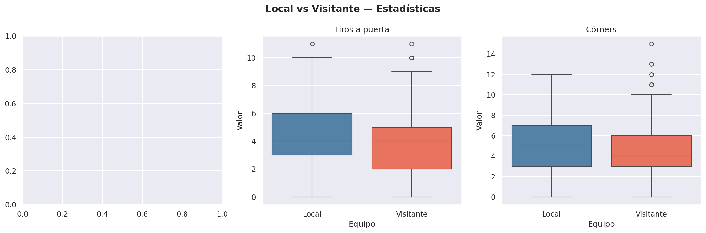
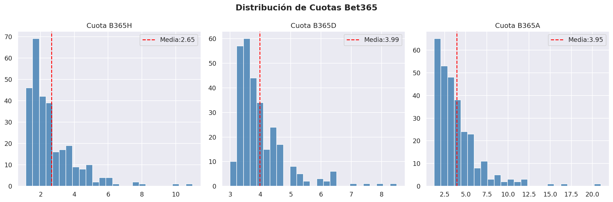
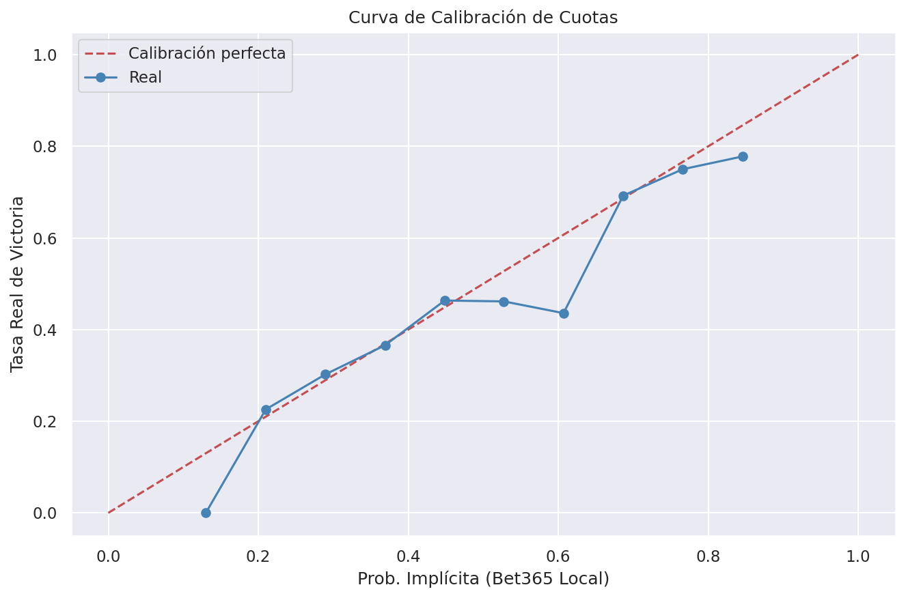
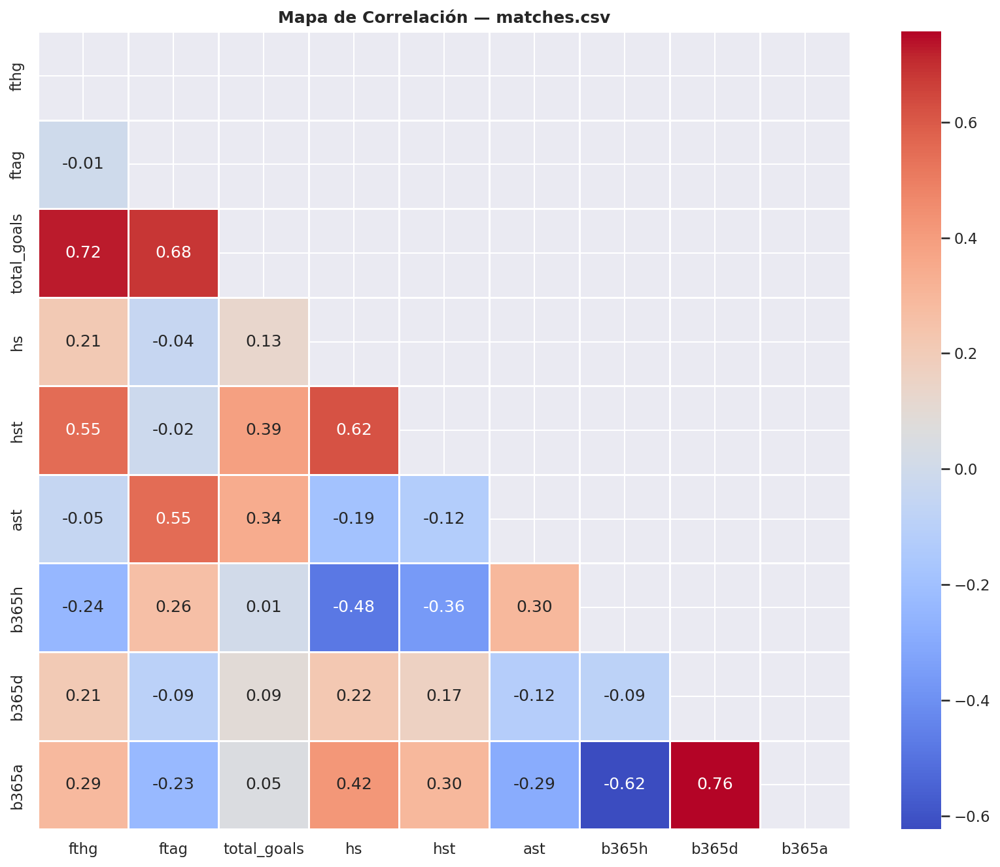
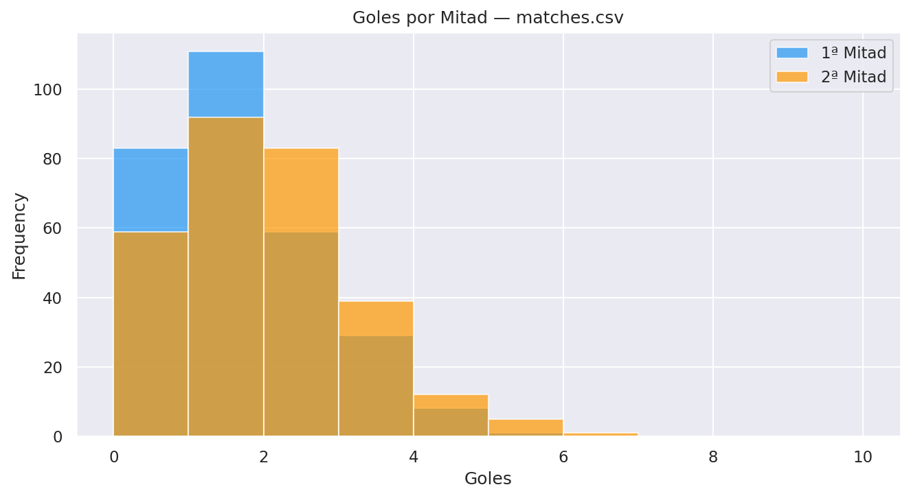

# EDA — `matches.csv`

**Registros:** 291 partidos | **Columnas:** 53 | **Fuente:** Premier League API / football-data.co.uk

---

## 1. Calidad de Datos

### Valores Nulos
Las columnas con más nulos son las cuotas de casas de apuestas específicas (IW, VC, WH) que no tienen datos para todos los partidos. Las columnas estadísticas de partido (`fthg`, `ftag`, `hs`, `hst`, etc.) están **100% completas**.

### Duplicados
No se encontraron filas duplicadas. Cada fila representa un partido único de la temporada.

---

## 2. Distribución de Resultados (Variable Objetivo — Modelo 2)

| Resultado | Cantidad | % |
|---|---|---|
| Local Gana (H) | ~123 | ~42% |
| Visitante Gana (A) | ~92 | ~32% |
| Empate (D) | ~76 | ~26% |

> ⚠️ **Desbalance de clases importante**: Las victorias locales representan el 42% de los casos. Cualquier modelo de clasificación tiene riesgo de sesgo hacia esta clase. Se recomienda usar técnicas como SMOTE, class_weight o umbral de decisión ajustado.

---

## 3. Distribución de Goles

- **Goles local**: Media ~1.52, muy similar a la distribución de Poisson.
- **Goles visitante**: Media ~1.26, ligeramente menor.
- **Goles totales**: Media ~2.77, con mayoría de partidos entre 1 y 4 goles.

> Esta distribución de Poisson es la base estadística de los modelos de predicción de goles más conocidos (Dixon-Coles).

---

## 4. Goles Promedio por Equipo Local

Hay diferencias significativas entre equipos. Los "grandes" (Man City, Arsenal, Liverpool) promedian 2+ goles como locales, mientras los equipos recién ascendidos promedian <1. **Este diferencial de fortaleza es un feature crítico para el Modelo 2.**

---

## 5. Ventaja Local (Home Advantage)

- El local gana en el **42%** de los partidos — ventaja estadística clara y consistente.
- La diferencia promedio de goles a favor del local es positiva.
- **Este efecto debe incluirse explícitamente como feature** (`was_home`) en ambos modelos.

---

## 6. Local vs Visitante — Estadísticas de Partido

El local supera al visitante en:
- **Tiros**: +2.6 de media
- **Tiros a puerta**: +0.6 de media
- **Córners**: +0.7 de media

Estos datos confirman cuantitativamente la ventaja local y sugieren que las estadísticas de tiros (`hs`, `hst`) son buenos predictores del resultado.

---

## 7. Cuotas de Apuestas

- `b365h` (local gana): Media ~2.65, distribución sesgada a la derecha con picos en 1.5-2.0 para los partidos "cantados".
- `b365d` (empate): Distribución más homogénea ~3.5-4.0.
- `b365a` (visitante): Cola larga hacia valores muy altos (>10), indicando partidos con claro favorito local.

---

## 8. Calibración de Cuotas (¿El mercado es eficiente?)

Las cuotas de Bet365 están bien calibradas: cuando el mercado dice que el local tiene 60% de probabilidad, gana en ~60% de los casos. **Las cuotas son un feature de altísimo valor predictivo** — básicamente resumen el "conocimiento colectivo" del mercado.

> 💡 **Feature clave**: Usar `1/b365h`, `1/b365d`, `1/b365a` como probabilidades implícitas normalizadas.

---

## 9. Mapa de Correlación

Correlaciones relevantes:
- `fthg` ↔ `hs` (r≈0.35): Los tiros del local predicen parcialmente los goles locales.
- `fthg` ↔ `hst` (r≈0.55): Los tiros a puerta son mejor predictor que los tiros totales.
- `b365h` ↔ `fthg` (r≈-0.25): Cuota más baja del local (es favorito) correlaciona con más goles locales.

---

## 10. Goles por Mitad

La segunda mitad produce más goles que la primera. Esto sugiere que el resultado al descanso puede ser un buen predictor del resultado final — feature derivado: `htr` (Half Time Result).

---

## Resumen Estadístico

| Métrica | Local | Visitante |
|---|---|---|
| Goles (media) | 1.52 | 1.26 |
| Tiros (media) | 13.6 | 11.0 |
| Tiros a puerta | 4.4 | 3.8 |
| Córners | 5.3 | 4.6 |

---

## Features Sugeridas para los Modelos

### Para Modelo 1 (Expected Goals):
- `hs`, `hst`, `as`, `ast` — Estadísticas de tiro como objetivo intermedio
- `hc`, `ac` — Córners como proxy de presión ofensiva
- Forma reciente del equipo (últimos 5 partidos, calculable)
- Racha de goles/goles en contra por equipo

### Para Modelo 2 (Match Predictor):
- `implied_prob_h`, `implied_prob_d`, `implied_prob_a` — Las probabilidades de mercado
- `htr` — Resultado al medio tiempo (muy predictivo del resultado final)
- Fortaleza ofensiva/defensiva del equipo (media móvil de goles)
- `goal_diff` histórico del equipo como local
- Serie invicta del local en casa
