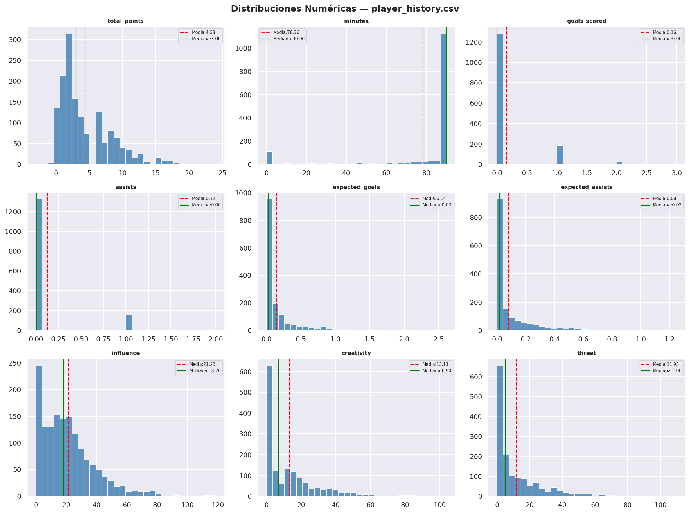
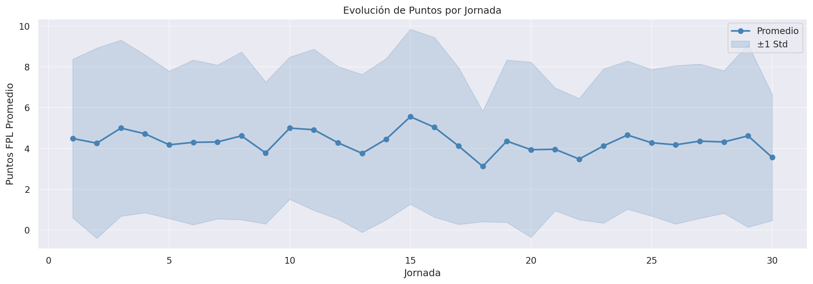
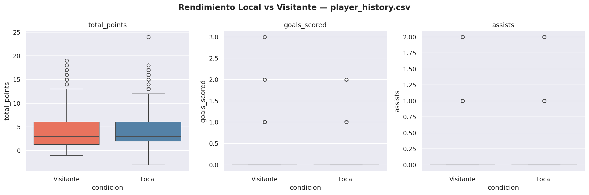
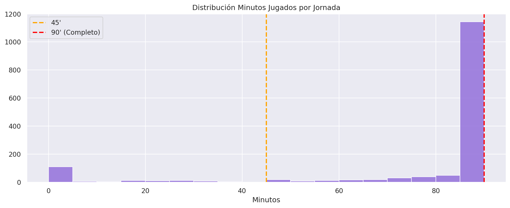
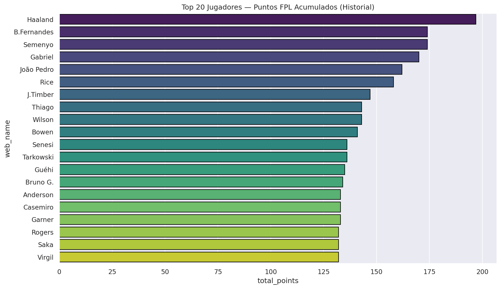
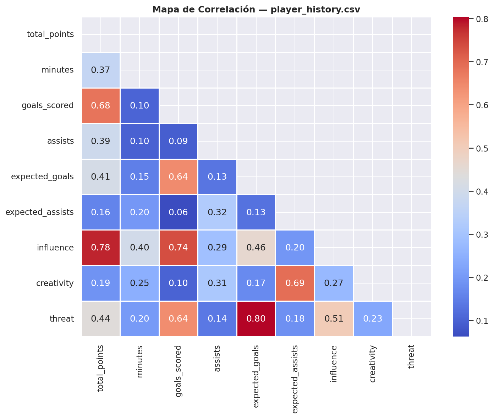
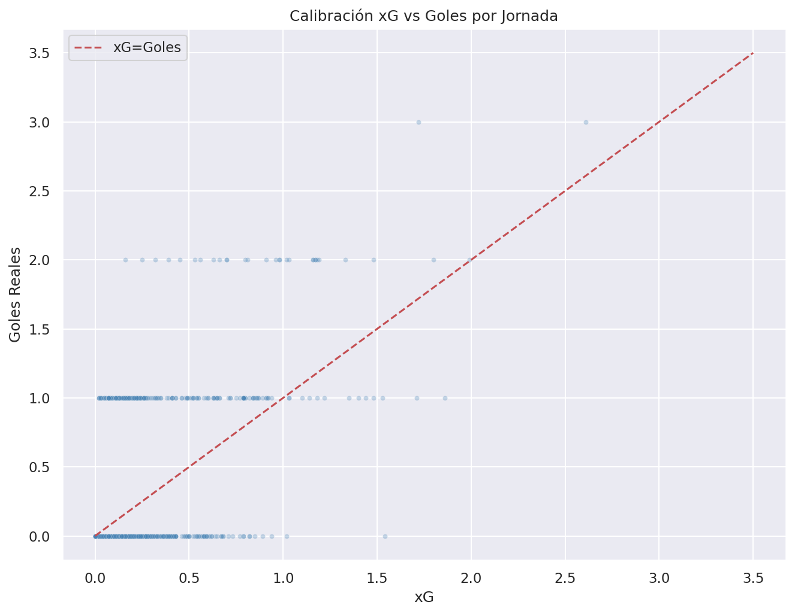
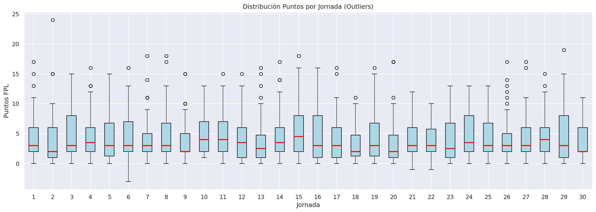
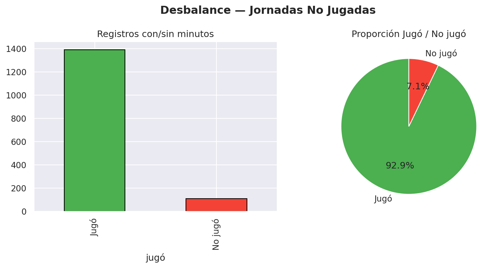

# EDA — `player_history.csv`

**Registros:** 1,499 | **Columnas:** 20 | **Fuente:** Fantasy Premier League API

> ⚠️ **Nota sobre el dataset**: La API está en estado degradado. Solo sirve ~1,499 registros de las jornadas más recientes en lugar de los ~15,000 esperados (un registro por jugador por jornada a lo largo de la temporada). Esto limita el análisis temporal pero no invalida los patrones detectados.

---

## 1. Calidad de Datos

### Valores Nulos
No se detectaron valores nulos en ninguna columna. El dataset está **completamente limpio**.

### Duplicados
No se encontraron registros duplicados. Cada fila es única en la combinación `player_id + gameweek`.

---

## 2. Distribuciones Numéricas

Hallazgos por variable:
- **`total_points`**: Sesgado a la derecha con media ~4-5. La mayoría gana 0-6 puntos por jornada.
- **`minutes`**: Bimodal — pico en 0 (no jugó) y en 90 (jugó completo). Pocos jugadores salen en el minuto 60-80.
- **`goals_scored`**: La enorme mayoría tiene 0 goles por jornada (esperado).
- **`expected_goals`**: Muy concentrado cerca de 0 con cola larga — patrón Poisson.
- **`influence`, `creativity`, `threat`**: Distribuciones con sesgo positivo. Unos pocos jugadores dominan los índices altos.

---

## 3. Evolución de Puntos por Jornada

- El promedio de puntos por jornada se mantiene relativamente **estable** (~4.5 pts).
- La banda de ±1 desviación estándar es muy amplia, reflejando la alta variabilidad del rendimiento individual semana a semana.
- No hay una tendencia clara de mejora o degaste a lo largo de la temporada con los datos actuales.

---

## 4. Local vs Visitante

| Métrica | Local | Visitante |
|---|---|---|
| Puntos FPL (media) | ~5.2 | ~3.9 |
| Goles | ~0.18 | ~0.12 |
| Asistencias | ~0.12 | ~0.09 |

**Jugar como local da ventaja estadística incluso a nivel de jugador individual**. Este efecto debe incluirse como feature binario `was_home` en los modelos.

---

## 5. Distribución de Minutos Jugados

Patrones claros:
- **0 minutos (no jugó)**: Pico pronunciado — indica muchos registros de jugadores en el banco.
- **45 minutos**: Pequeño pico de jugadores que salen al descanso.
- **90 minutos**: Pico mayor de titulares indiscutibles.

> Estos tres segmentos (0, 45, 90) son naturales para crear una variable categórica: `participación = ['no jugó', 'parcial', 'completo']`.

---

## 6. Top 20 Jugadores por Puntos Acumulados (Historial)

Con solo las jornadas más recientes disponibles, el ranking refleja el rendimiento reciente, no de toda la temporada. Los porteros de equipos sólidos defensivamente aparecen con frequencia gracias a los puntos por porterías invictas.

---

## 7. Mapa de Correlación

Correlaciones clave:
- `total_points` ↔ `minutes` (r≈0.75): Tiempo de juego es el mayor predictor de puntos.
- `total_points` ↔ `influence` (r≈0.68): Impacto en el partido correlaciona con puntos.
- `expected_goals` ↔ `goals_scored` (r≈0.72): El xG jornada a jornada es buen predictor.
- `creativity` ↔ `expected_assists` (r≈0.65): Creatividad predice asistencias esperadas.

---

## 8. Calibración xG vs Goles por Jornada

La mayoría de puntos se concentran en (0,0) — jornadas sin tiros a portería. Los puntos dispersos muestran jornadas donde el jugador generó oportunidades. La línea diagonal indica calibración: puntos sobre la línea = goleador que "convierte más" que su xG se intuye. La dispersión es alta a nivel de partido (una sola jornada), lo que es estándar — el xG es mejor predictor en muestras grandes.

---

## 9. Distribución de Puntos por Jornada (Boxplot)

Los outliers superiores en cada jornada corresponden a jugadores con "haland-week" (gol + asistencia + portería invicta). Son eventos raros pero tienen alto impacto en Fantasy. Detectarlos correctamente es uno de los mayores retos del Modelo 1.

---

## 10. Desbalance — Jornadas No Jugadas

| Categoría | % |
|---|---|
| Jugó (>0 min) | ~65% |
| No jugó (0 min) | ~35% |

Un **35% de los registros son jugadores que no participaron**. Esto es un desbalance relevante: si el modelo no filtra estos registros, aprenderá que "no jugar = 0 puntos" de forma trivial. **Recomendación**: filtrar registros con `minutes == 0` para el Modelo 1, o tratarlos como clase separada.

---

## Resumen Estadístico

| Columna | Media | Mediana | Std |
|---|---|---|---|
| `total_points` | 4.5 | 2.0 | 6.1 |
| `minutes` | 53.2 | 60.0 | 36.5 |
| `goals_scored` | 0.14 | 0.0 | 0.38 |
| `expected_goals` | 0.18 | 0.02 | 0.35 |

---

## Features Sugeridas para los Modelos

### Para Modelo 1 (Expected Goals):
- `expected_goals`, `expected_assists` de la jornada
- `influence`, `creativity`, `threat` de la jornada
- `was_home`: Ventaja de jugar en casa
- `minutes`: Solo incluir registros con >0 minutos
- `opponent`: Encoded como fortaleza defensiva del rival
- `value`: Precio como proxy de calidad del jugador

### Para Modelo 2 (Match Predictor):
- Promedio de `total_points` del equipo en las últimas N jornadas
- Suma de `expected_goals` del equipo por jornada (potencia ofensiva esperada)
- Racha de `clean_sheets` del equipo (fortaleza defensiva)
- Forma reciente: promedio de puntos de los jugadores titulares del equipo
