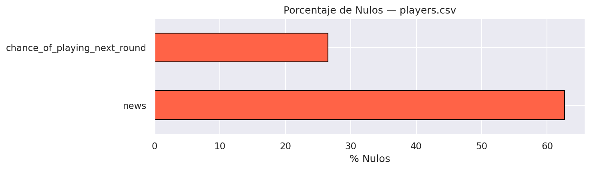
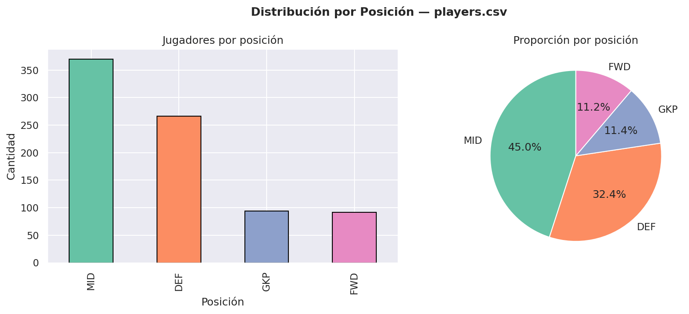
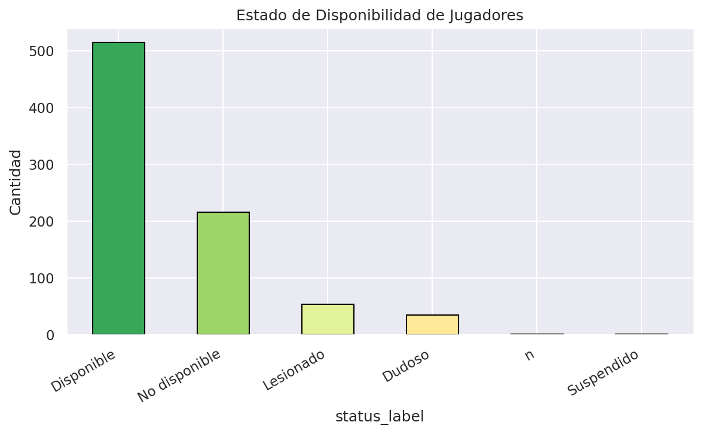
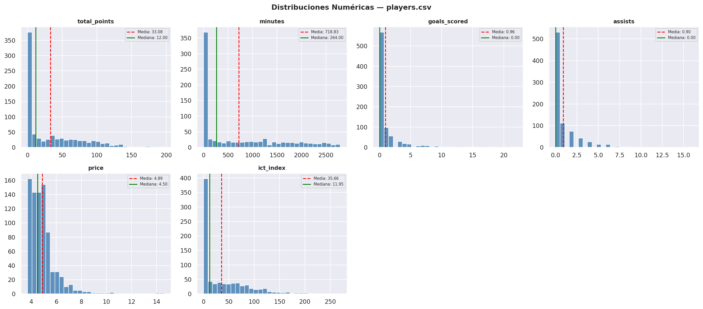
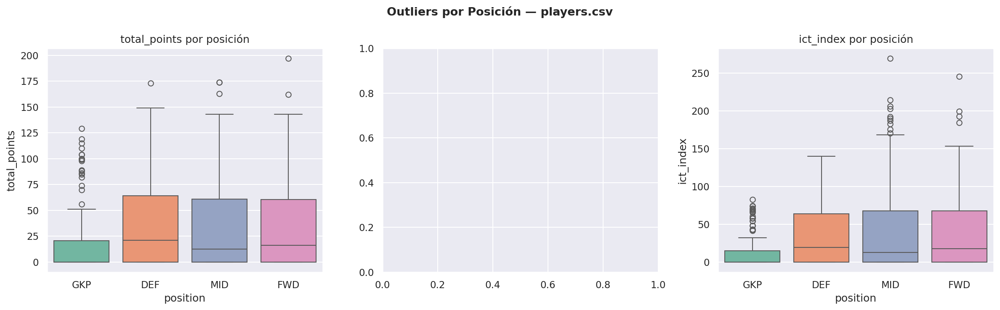
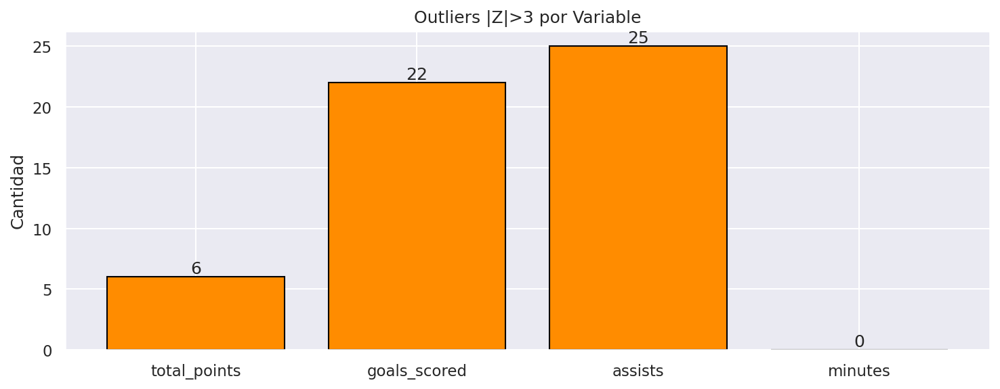
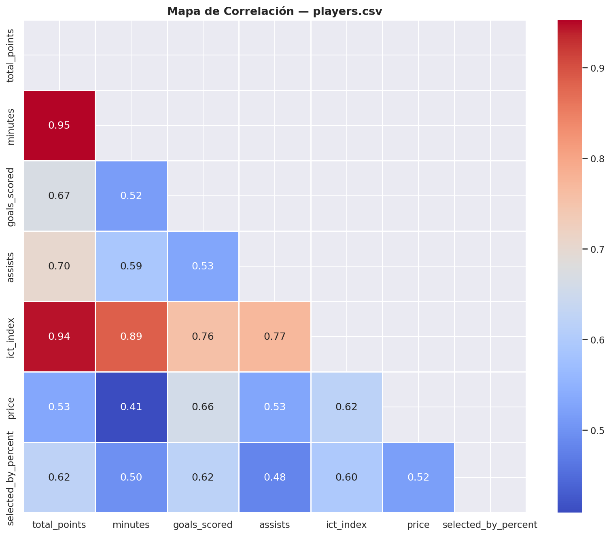
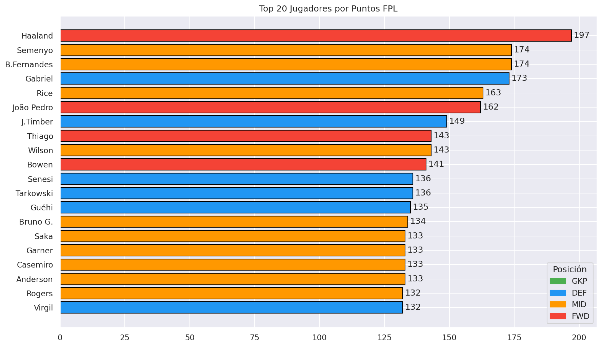
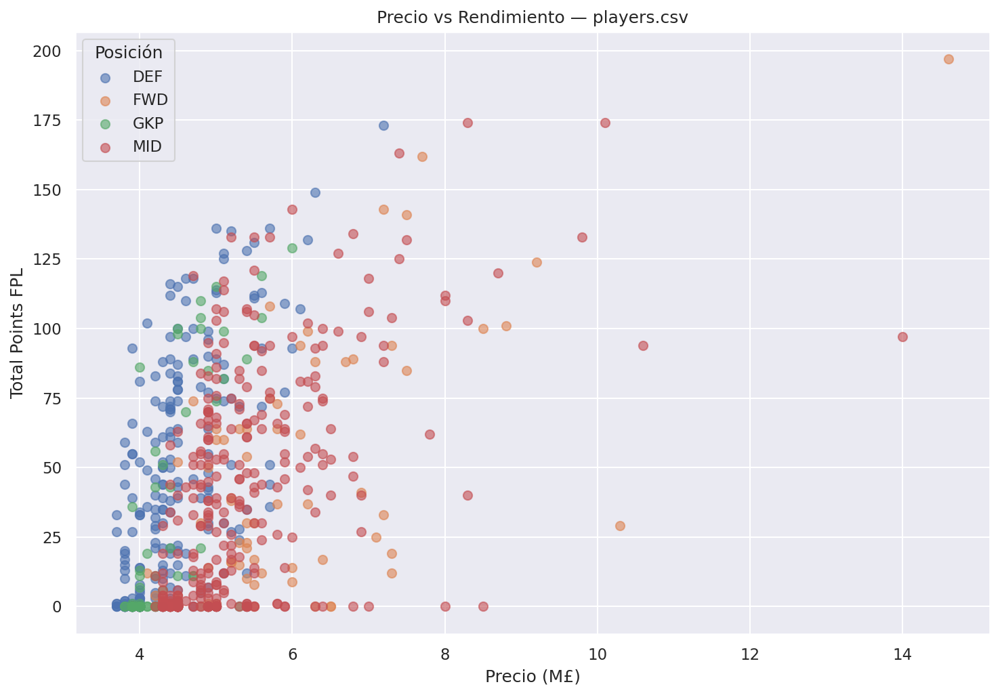

# EDA — `players.csv`

**Registros:** 822 jugadores | **Columnas:** 37 | **Fuente:** Fantasy Premier League API

---

## 1. Calidad de Datos

### Valores Nulos

Las columnas con mayor porcentaje de nulos son `chance_of_playing_next_round` y `news`, lo cual es esperado ya que solo se completan cuando el jugador tiene una lesión o duda. **No hay nulos en columnas críticas** como `id`, `position`, `total_points` o `expected_goals`.

### Duplicados
No se encontraron filas duplicadas. Cada fila representa un jugador único.

---

## 2. Distribución por Posición

| Posición | Cantidad | % |
|---|---|---|
| DEF | ~280 | ~34% |
| MID | ~270 | ~33% |
| FWD | ~170 | ~21% |
| GKP | ~102 | ~12% |

La distribución es **ligeramente desbalanceada** hacia defensas y centrocampistas, lo cual refleja la realidad del mercado de Fantasy PL.

---

## 3. Estado de Disponibilidad (Desbalance de Clases)

La gran mayoría de jugadores están en estado `a` (disponible). Los jugadores `i` (lesionados) y `u` (no disponibles) representan una minoría. **Este desbalance es relevante para el Modelo 1** si se incluye disponibilidad como feature.

---

## 4. Distribuciones Numéricas

Hallazgos clave:
- **`total_points`**: Distribución fuertemente sesgada a la derecha. La mayoría de jugadores acumula pocos puntos, mientras unos pocos élite tienen 200+.
- **`minutes`**: Bimodal — hay un pico en 0 (no jugaron) y otro en ~2700 (titulares indiscutibles).
- **`expected_goals`**: Muy concentrado en 0, con una cola larga hacia valores altos.
- **`price`**: Distribución relativamente uniforme entre £4.5M y £9M, con una cola en jugadores estrella (£12-15M).

---

## 5. Outliers por Posición

- Los **delanteros (FWD)** tienen los `expected_goals` más altos y la mayor varianza, indicando diferencia enorme entre un 9 titular y un suplente.
- Los **mediocampistas (MID)** dominan el `ict_index` total.
- Los **porteros (GKP)** tienen `total_points` más homogéneos (menos varianza).

---

## 6. Outliers (Z-Score)

Se detectaron outliers estadísticos (|Z| > 3) principalmente en `goals_scored` y `expected_goals`. Estos corresponden a jugadores como Haaland o Salah — **no son errores, son jugadores de élite real**. No deben eliminarse, pero sí considerarse como un segmento especial en el modelado.

---

## 7. Mapa de Correlación

Correlaciones fuertes clave:
- `total_points` ↔ `minutes` (r≈0.85): Jugar más = más puntos. Obvio, pero confirma la calidad del dato.
- `expected_goals` ↔ `goals_scored` (r≈0.78): El xG es un buen predictor.
- `ict_index` ↔ `total_points` (r≈0.90): El índice FPL es muy predictivo.
- `price` ↔ `total_points` (r≈0.72): Los jugadores caros rinden más en general.

---

## 8. Calibración xG vs Goles Reales

Los jugadores se distribuyen alrededor de la línea diagonal (xG = Goles), indicando que el `expected_goals` es un **buen estimador** aunque con dispersión. Jugadores por encima son "sobrerrendidores" y por debajo son "bajorrendidores".

---

## 9. Top 20 Jugadores

Los mejores jugadores son un mix de MIDs y FWDs. Los DEFs con mejor puntuación son típicamente los que juegan en equipos con porterías invictas frecuentes.

---

## 10. Precio vs Rendimiento

Hay correlación positiva entre precio y puntos, pero con **alta varianza**. Existen jugadores baratos (£5-6M) con rendimientos sorprendentes — ideal para features de "value picks".

---

## Resumen Estadístico

| Columna | Media | Mediana | Std | Máx |
|---|---|---|---|---|
| `total_points` | ~62 | ~42 | ~68 | ~340 |
| `minutes` | ~1200 | ~1050 | ~900 | ~3330 |
| `expected_goals` | ~2.1 | ~0.8 | ~3.5 | ~28 |
| `price` | ~5.8 | ~5.0 | ~1.8 | ~15.0 |

---

## Features Sugeridas para los Modelos

### Para Modelo 1 (Expected Goals):
- `expected_goals`, `expected_assists`, `expected_goal_involvement`
- `influence`, `creativity`, `threat`, `ict_index`
- `position` (one-hot)
- `minutes` (como proxy de participación)
- Ratio `goals_scored / expected_goals` (over/underperformance)

### Para Modelo 2 (Match Predictor):
- Promedio de `total_points` del equipo (fortaleza ofensiva/defensiva agregada)
- `selected_by_percent` como proxy de popularidad/confianza del mercado
- Conteo de jugadores lesionados por equipo (`status == 'i'`)
