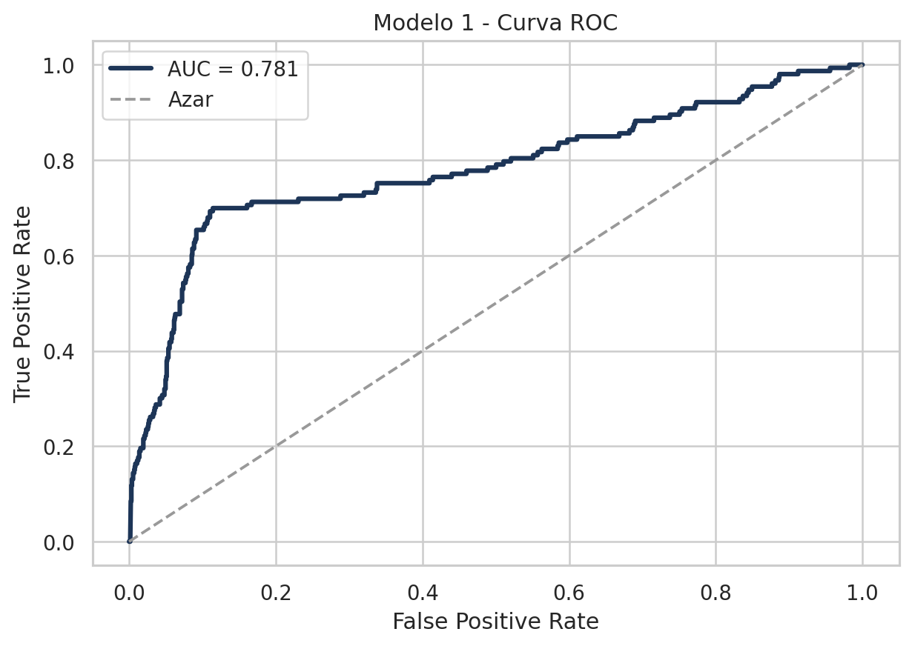
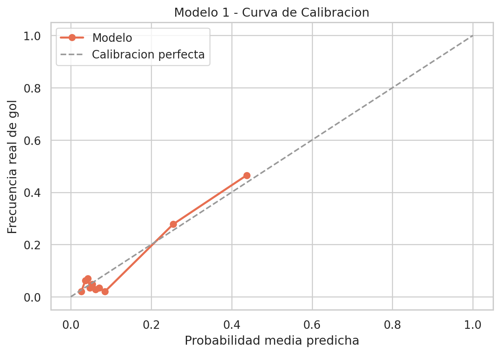
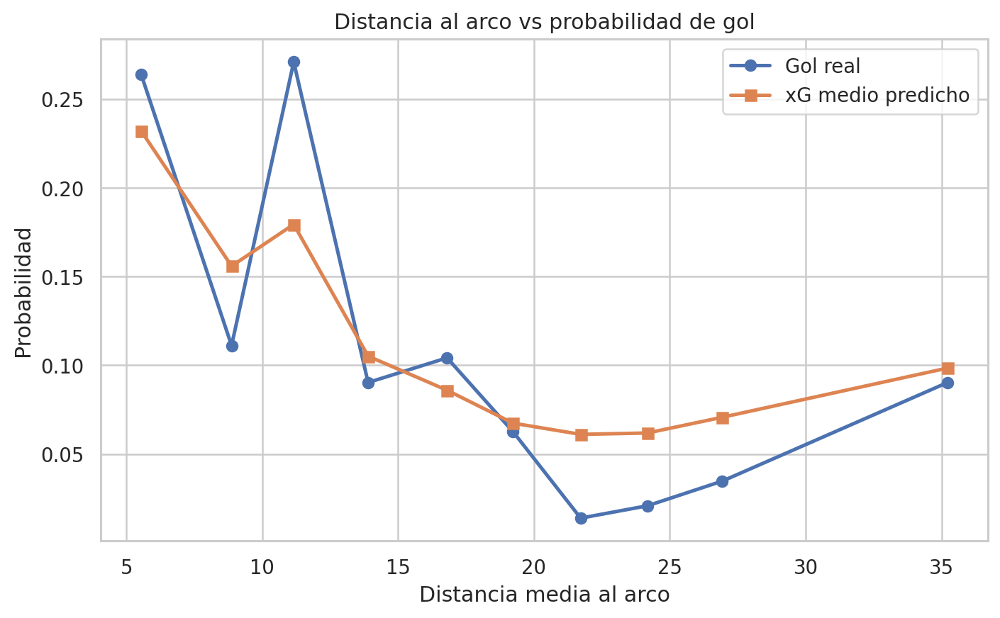
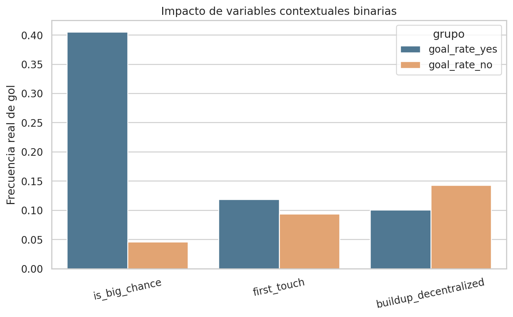
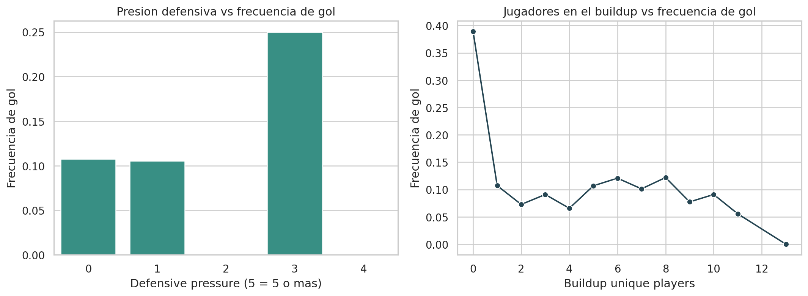
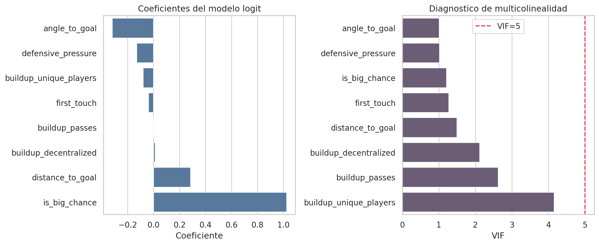

# Analisis del Modelo 1

## 1. Objetivo del modelo

El `Modelo 1` busca estimar `xG` a nivel de tiro. En terminos practicos, esto significa responder la pregunta:

> Dadas las caracteristicas del remate y su contexto inmediato, cual es la probabilidad de que termine en gol.

Por eso elegimos una **Regresion Logistica** y no una regresion lineal:

- el target observado es binario: `is_goal = 1` o `0`
- `xG` no se observa directamente, sino que es una probabilidad estimada
- la regresion logistica produce una salida natural entre `0` y `1`

La version oficial del modelo se entrena en formato **unweighted**, es decir, sin reponderar artificialmente la clase gol. Eso permite que la probabilidad estimada refleje mejor la tasa real de conversion de tiros.

## 2. Por que elegimos estas variables

Partimos de dos criterios:

1. El taller exige features geometricas obligatorias.
2. El modelo debe seguir siendo interpretable y evitar multicolinealidad severa.

### Variables obligatorias

- `distance_to_goal`
- `angle_to_goal`

Estas dos variables forman la base clasica del xG porque describen la dificultad geometrica del remate.

### Variables avanzadas elegidas

- `is_big_chance`
- `defensive_pressure`
- `buildup_passes`
- `buildup_unique_players`
- `buildup_decentralized`
- `first_touch`

La logica de seleccion fue:

- agregar contexto real de la jugada, no solo posicion espacial
- conservar VIF razonable
- evitar features post-shot como `porteria_zone_*`, que se acercan al leakage si el objetivo es predecir antes de conocer el destino exacto del remate

## 3. Como construimos las features

### 3.1 Geometria del tiro

Se derivaron desde las coordenadas `x`, `y`:

```python
distance_to_goal = sqrt((100 - x)^2 + (50 - y)^2)
angle_to_goal    = abs(arctan2(50 - y, 100 - x))
```

Estas variables resumen:

- cercania al arco
- apertura del angulo de remate

### 3.2 Big chance

`is_big_chance` se extrajo desde `qualifiers`. Esta variable condensa contexto tactico de ventaja ofensiva que no queda explicado solo por la geometria.

### 3.3 Defensive pressure

`defensive_pressure` cuenta cuantas acciones rivales ocurrieron cerca del tirador en el mismo minuto del partido.

Idea futbolistica:

- mas presion defensiva implica menos tiempo de ejecucion
- peor perfil corporal
- mayor probabilidad de tiro bloqueado o mal golpeado

### 3.4 Buildup quality

Se construyeron tres variables desde la secuencia previa al tiro:

- `buildup_passes`
- `buildup_unique_players`
- `buildup_decentralized`

Estas capturan si la ocasion nace:

- de una circulacion breve y limpia
- de una jugada mas coral
- o de una posesion ya estabilizada por la defensa rival

### 3.5 First touch

`first_touch` se extrajo desde `qualifiers` como indicador biomecanico y temporal. Un remate de primer toque elimina un control previo, pero tambien cambia la mecanica del golpeo.

## 4. Variables que descartamos y por que

### `dist_squared` y `dist_angle`

Se descartaron del modelo final porque repiten demasiada informacion de `distance_to_goal` y elevan colinealidad.

### `porteria_zone_*`

Aunque son muy potentes, describen donde termino yendo el tiro dentro de la porteria o su trayecto final. Eso es muy util para analisis post-shot, pero no es ideal como feature principal de un xG pre-shot.

### `RightFoot`, `LeftFoot` y `Head`

Estas variables si se construyeron en el feature engineering, pero no quedaron como features finales independientes.

La razon principal fue de estabilidad:

- forman un bloque casi mutuamente excluyente
- eso introduce redundancia estructural
- en pruebas previas elevaban la colinealidad y hacian menos parsimonioso el modelo

Parte de su informacion sigue capturada por:

- `is_big_chance`
- `first_touch`
- `defensive_pressure`
- la propia geometria del tiro

### Zonas tipo `BoxCentre`, `OutOfBoxCentre`, `SmallBoxCentre`

No las ignoramos; las absorbimos en una representacion espacial mas robusta.

En la practica, esa informacion ya estaba codificada por:

- `distance_to_goal`
- `angle_to_goal`
- variables exploratorias como `is_in_area` e `is_central`

Es decir, en vez de discretizar el espacio en categorias fijas, el modelo final usa una geometria continua que suele ser mas estable.

### Features historicas de equipo

Variables como `home_xg_debt_5`, `momentum`, `home_bias` o `clutch_ratio` son mas utiles para el `Modelo 2`, donde el nivel natural de analisis es el partido.

## 5. Desempeno del modelo

Metricas principales:

- `AUC-ROC`: 0.7813
- `Log Loss`: 0.2599
- `Brier Score`: 0.0733
- `Accuracy @ 0.5`: 0.9028
- `Precision @ 0.5`: 0.7826
- `Recall @ 0.5`: 0.1176
- `F1 @ 0.5`: 0.2045
- `Baseline naive accuracy`: 0.8938
- `xG medio predicho`: 0.1118
- `Tasa real de gol`: 0.1062

Lectura:

- el AUC muestra buena capacidad de separar tiros peligrosos de tiros poco peligrosos
- el Brier Score indica una calibracion buena para un modelo simple e interpretable
- la accuracy no debe leerse sola, porque el dataset esta desbalanceado hacia no-gol
- el hecho de que el xG medio predicho quede muy cerca de la tasa real de gol indica que el modelo es creible como xG final

## 6. Diagnostico de multicolinealidad

El VIF del set final se mantuvo bajo control:

- maximo VIF: `4.15`
- ningun predictor supero el umbral clasico de `5`

Eso es importante porque queriamos un modelo interpretable, no solo un clasificador que funcione.

## 7. Graficas explicativas

### 7.1 Curva ROC



Muestra la capacidad del modelo de distinguir goles de no goles en distintos umbrales.

### 7.2 Curva de calibracion



Compara la probabilidad predicha con la frecuencia real de gol. Esto es clave porque `xG` no solo debe rankear bien, tambien debe ser probabilisticamente util.

### 7.3 Distancia al arco vs gol real y xG predicho



Esta grafica explica por que la distancia sigue siendo una variable obligatoria: a mayor distancia, menor tasa real de gol y menor xG medio.

### 7.4 Impacto de variables binarias de contexto



Aqui se ve visualmente como `is_big_chance`, `first_touch` y `buildup_decentralized` cambian la frecuencia real de gol.

### 7.5 Presion defensiva y complejidad del buildup



Esta grafica justifica por que no nos quedamos solo con geometria: el contexto tactico de la jugada altera la conversion.

### 7.6 Coeficientes y VIF



Resume dos ideas centrales del modelo:

- que variables empujan o frenan la probabilidad de gol
- que el set final sigue siendo estadisticamente estable

## 8. Lectura futbolistica final

El modelo dice algo bastante coherente con el juego:

- una `big chance` aumenta fuertemente la probabilidad de gol
- un angulo peor y mas presion defensiva la reducen
- la forma en que se construye la jugada tambien importa

En otras palabras, el xG no depende solo de donde pateas, sino de **como llegaste a patear**.

## 9. Archivos de soporte

- Script del modelo: [train_modelo_1.py](/home/camilo/proyectos/Ml_Futbol/modelo%201/train_modelo_1.py)
- Reporte resumido: [reporte_modelo_1.md](/home/camilo/proyectos/Ml_Futbol/modelo%201/artifacts/reporte_modelo_1.md)
- Coeficientes: [coefficients.csv](/home/camilo/proyectos/Ml_Futbol/modelo%201/artifacts/coefficients.csv)
- VIF: [vif.csv](/home/camilo/proyectos/Ml_Futbol/modelo%201/artifacts/vif.csv)
- Resumen logit: [logit_summary.txt](/home/camilo/proyectos/Ml_Futbol/modelo%201/artifacts/logit_summary.txt)
